# 2012 Election Data Analysis

In this project we will analyze two datasets. The first data set will be the results of political polls. We will analyze this aggregated poll data and answer some questions:

1) Who was being polled and what was their party affiliation?

2) Did the poll results favor Romney or Obama?

3) How do undecided voters effect the poll?

4) Can we account for the undecided voters?

5) How did voter sentiment change over time?

6) Can we see an effect in the polls from the debates?


Lets start with our standard imports


```python
# For data
import pandas as pd
from pandas import Series,DataFrame,DatetimeIndex
import numpy as np

# For visualization
import matplotlib.pyplot as plt
import seaborn as sns
sns.set_style('whitegrid')
%matplotlib inline

from __future__ import division
```

We have our data so lets create the DataFrame with the downloaded csv


```python
poll_df = pd.read_csv('/Users/alexreynolds/Documents/Data Projects/Election Analysis/2012generalelectiondata.csv')
```

Preview the dataset


```python
poll_df.head()
```

<table border="1" class="dataframe">
  <thead>
    <tr style="text-align: right;">
      <th></th>
      <th>Pollster</th>
      <th>Start Date</th>
      <th>End Date</th>
      <th>Entry Date/Time (ET)</th>
      <th>Number of Observations</th>
      <th>Population</th>
      <th>Mode</th>
      <th>Obama</th>
      <th>Romney</th>
      <th>Undecided</th>
      <th>Other</th>
      <th>Pollster URL</th>
      <th>Source URL</th>
      <th>Partisan</th>
      <th>Affiliation</th>
      <th>Question Text</th>
      <th>Question Iteration</th>
    </tr>
  </thead>
  <tbody>
    <tr>
      <th>0</th>
      <td>Politico/GWU/Battleground</td>
      <td>11/4/12</td>
      <td>11/5/12</td>
      <td>2012-11-06T08:40:26Z</td>
      <td>1000.0</td>
      <td>Likely Voters</td>
      <td>Live Phone</td>
      <td>47</td>
      <td>47</td>
      <td>6.0</td>
      <td>NaN</td>
      <td>https://elections.huffingtonpost.com/pollster/...</td>
      <td>http://www.politico.com/news/stories/1112/8338...</td>
      <td>Nonpartisan</td>
      <td>None</td>
      <td>NaN</td>
      <td>1</td>
    </tr>
    <tr>
      <th>1</th>
      <td>YouGov/Economist</td>
      <td>11/3/12</td>
      <td>11/5/12</td>
      <td>2012-11-26T15:31:23Z</td>
      <td>740.0</td>
      <td>Likely Voters</td>
      <td>Internet</td>
      <td>49</td>
      <td>47</td>
      <td>3.0</td>
      <td>NaN</td>
      <td>https://elections.huffingtonpost.com/pollster/...</td>
      <td>http://cdn.yougov.com/cumulus_uploads/document...</td>
      <td>Nonpartisan</td>
      <td>None</td>
      <td>NaN</td>
      <td>1</td>
    </tr>
    <tr>
      <th>2</th>
      <td>Gravis Marketing</td>
      <td>11/3/12</td>
      <td>11/5/12</td>
      <td>2012-11-06T09:22:02Z</td>
      <td>872.0</td>
      <td>Likely Voters</td>
      <td>Automated Phone</td>
      <td>48</td>
      <td>48</td>
      <td>4.0</td>
      <td>NaN</td>
      <td>https://elections.huffingtonpost.com/pollster/...</td>
      <td>http://www.gravispolls.com/2012/11/gravis-mark...</td>
      <td>Nonpartisan</td>
      <td>None</td>
      <td>NaN</td>
      <td>1</td>
    </tr>
    <tr>
      <th>3</th>
      <td>IBD/TIPP</td>
      <td>11/3/12</td>
      <td>11/5/12</td>
      <td>2012-11-06T08:51:48Z</td>
      <td>712.0</td>
      <td>Likely Voters</td>
      <td>Live Phone</td>
      <td>50</td>
      <td>49</td>
      <td>NaN</td>
      <td>1.0</td>
      <td>https://elections.huffingtonpost.com/pollster/...</td>
      <td>http://news.investors.com/special-report/50841...</td>
      <td>Nonpartisan</td>
      <td>None</td>
      <td>NaN</td>
      <td>1</td>
    </tr>
    <tr>
      <th>4</th>
      <td>Rasmussen</td>
      <td>11/3/12</td>
      <td>11/5/12</td>
      <td>2012-11-06T08:47:50Z</td>
      <td>1500.0</td>
      <td>Likely Voters</td>
      <td>Automated Phone</td>
      <td>48</td>
      <td>49</td>
      <td>NaN</td>
      <td>NaN</td>
      <td>https://elections.huffingtonpost.com/pollster/...</td>
      <td>http://www.rasmussenreports.com/public_content...</td>
      <td>Nonpartisan</td>
      <td>None</td>
      <td>NaN</td>
      <td>1</td>
    </tr>
  </tbody>
</table>

```python
poll_df.info()
```

    <class 'pandas.core.frame.DataFrame'>
    RangeIndex: 586 entries, 0 to 585
    Data columns (total 17 columns):
     #   Column                  Non-Null Count  Dtype  
    ---  ------                  --------------  -----  
     0   Pollster                586 non-null    object 
     1   Start Date              586 non-null    object 
     2   End Date                586 non-null    object 
     3   Entry Date/Time (ET)    586 non-null    object 
     4   Number of Observations  564 non-null    float64
     5   Population              586 non-null    object 
     6   Mode                    586 non-null    object 
     7   Obama                   586 non-null    int64  
     8   Romney                  586 non-null    int64  
     9   Undecided               423 non-null    float64
     10  Other                   202 non-null    float64
     11  Pollster URL            586 non-null    object 
     12  Source URL              584 non-null    object 
     13  Partisan                586 non-null    object 
     14  Affiliation             586 non-null    object 
     15  Question Text           0 non-null      float64
     16  Question Iteration      586 non-null    int64  
    dtypes: float64(4), int64(3), object(10)
    memory usage: 78.0+ KB


Quick Visualization of the affiliation of the polls using countplot


```python
sns.countplot('Affiliation', data = poll_df)
```


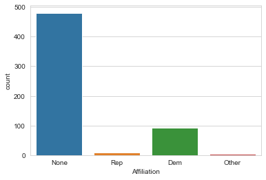
    


Overall, neutral affilication but is leaning toward democratic.  This will have to be kept in mind during our analysis.

Lets see if sorting by population gives any further insight into data


```python
sns.countplot('Affiliation', data=poll_df, hue='Population')
```


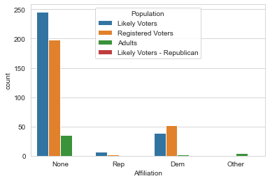
    


See a strong prescense of likely and registered voters so the poll data should be a good reflection on the populations polled.

Lets look at averages for Obama, Romney, and the undecided


```python
#Get the average 
avg= pd.DataFrame(poll_df.mean())

avg.drop(['Number of Observations','Other','Question Text','Question Iteration'], axis=0,inplace=True)

```


```python
avg.head()
```

<table border="1" class="dataframe">
  <thead>
    <tr style="text-align: right;">
      <th></th>
      <th>0</th>
    </tr>
  </thead>
  <tbody>
    <tr>
      <th>Obama</th>
      <td>46.805461</td>
    </tr>
    <tr>
      <th>Romney</th>
      <td>44.614334</td>
    </tr>
    <tr>
      <th>Undecided</th>
      <td>6.550827</td>
    </tr>
  </tbody>
</table>

```python
#Get the error
std = pd.DataFrame(poll_df.std())
std.drop(['Number of Observations','Other','Question Text','Question Iteration'],axis=0,inplace=True)
```


```python
std.head()
```

<table border="1" class="dataframe">
  <thead>
    <tr style="text-align: right;">
      <th></th>
      <th>0</th>
    </tr>
  </thead>
  <tbody>
    <tr>
      <th>Obama</th>
      <td>2.422058</td>
    </tr>
    <tr>
      <th>Romney</th>
      <td>2.906180</td>
    </tr>
    <tr>
      <th>Undecided</th>
      <td>3.701754</td>
    </tr>
  </tbody>
</table>

```python
#Plot avg and std with yerr
avg.plot(yerr=std,kind='bar',legend=False)
```


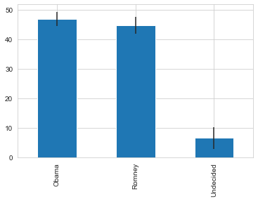
    


Interesting to see how close this race is, especially with the undecided factor


```python
#Combine avg and std DataFrames
poll_avg = pd.concat([avg,std],axis=1)
```


```python
#Rename Columns
poll_avg.columns=['Average','STD']
```


```python
#Show
poll_avg
```

<table border="1" class="dataframe">
  <thead>
    <tr style="text-align: right;">
      <th></th>
      <th>Average</th>
      <th>STD</th>
    </tr>
  </thead>
  <tbody>
    <tr>
      <th>Obama</th>
      <td>46.805461</td>
      <td>2.422058</td>
    </tr>
    <tr>
      <th>Romney</th>
      <td>44.614334</td>
      <td>2.906180</td>
    </tr>
    <tr>
      <th>Undecided</th>
      <td>6.550827</td>
      <td>3.701754</td>
    </tr>
  </tbody>
</table>
Numbers show a close race too. It seems to come down to the undecided voters.  If we assume the undecided voters will split their votes evenly, it should be an unbiased estimate of the final difference.

First lets look at a time series analysis by looking at voter sentiment versus the Poll End Dates.


```python
poll_df.plot(x='End Date',y=['Obama','Romney','Undecided'],linestyle='',marker='o')
```


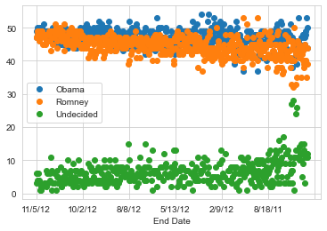
    


We can see that the race gets closer as the elction approaches (time is represented backwards here so closer to election is on the left). Lets plot out the difference between Obama and Romney and has it changes as time moves alone. 


```python
#for timestamps
from datetime import datetime
```

Create a new column for the difference between Romney and Obama in th polls


```python
poll_df['Difference'] = (poll_df.Obama - poll_df.Romney)/100
```


```python
poll_df.head()
```

<table border="1" class="dataframe">
  <thead>
    <tr style="text-align: right;">
      <th></th>
      <th>Pollster</th>
      <th>Start Date</th>
      <th>End Date</th>
      <th>Entry Date/Time (ET)</th>
      <th>Number of Observations</th>
      <th>Population</th>
      <th>Mode</th>
      <th>Obama</th>
      <th>Romney</th>
      <th>Undecided</th>
      <th>Other</th>
      <th>Pollster URL</th>
      <th>Source URL</th>
      <th>Partisan</th>
      <th>Affiliation</th>
      <th>Question Text</th>
      <th>Question Iteration</th>
      <th>Difference</th>
    </tr>
  </thead>
  <tbody>
    <tr>
      <th>0</th>
      <td>Politico/GWU/Battleground</td>
      <td>11/4/12</td>
      <td>11/5/12</td>
      <td>2012-11-06T08:40:26Z</td>
      <td>1000.0</td>
      <td>Likely Voters</td>
      <td>Live Phone</td>
      <td>47</td>
      <td>47</td>
      <td>6.0</td>
      <td>NaN</td>
      <td>https://elections.huffingtonpost.com/pollster/...</td>
      <td>http://www.politico.com/news/stories/1112/8338...</td>
      <td>Nonpartisan</td>
      <td>None</td>
      <td>NaN</td>
      <td>1</td>
      <td>0.00</td>
    </tr>
    <tr>
      <th>1</th>
      <td>YouGov/Economist</td>
      <td>11/3/12</td>
      <td>11/5/12</td>
      <td>2012-11-26T15:31:23Z</td>
      <td>740.0</td>
      <td>Likely Voters</td>
      <td>Internet</td>
      <td>49</td>
      <td>47</td>
      <td>3.0</td>
      <td>NaN</td>
      <td>https://elections.huffingtonpost.com/pollster/...</td>
      <td>http://cdn.yougov.com/cumulus_uploads/document...</td>
      <td>Nonpartisan</td>
      <td>None</td>
      <td>NaN</td>
      <td>1</td>
      <td>0.02</td>
    </tr>
    <tr>
      <th>2</th>
      <td>Gravis Marketing</td>
      <td>11/3/12</td>
      <td>11/5/12</td>
      <td>2012-11-06T09:22:02Z</td>
      <td>872.0</td>
      <td>Likely Voters</td>
      <td>Automated Phone</td>
      <td>48</td>
      <td>48</td>
      <td>4.0</td>
      <td>NaN</td>
      <td>https://elections.huffingtonpost.com/pollster/...</td>
      <td>http://www.gravispolls.com/2012/11/gravis-mark...</td>
      <td>Nonpartisan</td>
      <td>None</td>
      <td>NaN</td>
      <td>1</td>
      <td>0.00</td>
    </tr>
    <tr>
      <th>3</th>
      <td>IBD/TIPP</td>
      <td>11/3/12</td>
      <td>11/5/12</td>
      <td>2012-11-06T08:51:48Z</td>
      <td>712.0</td>
      <td>Likely Voters</td>
      <td>Live Phone</td>
      <td>50</td>
      <td>49</td>
      <td>NaN</td>
      <td>1.0</td>
      <td>https://elections.huffingtonpost.com/pollster/...</td>
      <td>http://news.investors.com/special-report/50841...</td>
      <td>Nonpartisan</td>
      <td>None</td>
      <td>NaN</td>
      <td>1</td>
      <td>0.01</td>
    </tr>
    <tr>
      <th>4</th>
      <td>Rasmussen</td>
      <td>11/3/12</td>
      <td>11/5/12</td>
      <td>2012-11-06T08:47:50Z</td>
      <td>1500.0</td>
      <td>Likely Voters</td>
      <td>Automated Phone</td>
      <td>48</td>
      <td>49</td>
      <td>NaN</td>
      <td>NaN</td>
      <td>https://elections.huffingtonpost.com/pollster/...</td>
      <td>http://www.rasmussenreports.com/public_content...</td>
      <td>Nonpartisan</td>
      <td>None</td>
      <td>NaN</td>
      <td>1</td>
      <td>-0.01</td>
    </tr>
  </tbody>
</table>
Keep in mind that the difference is Obama minus Romney, thus a positive difference indicates a leaning towards Obama in the polls.

Now lets see if we can visualize how this differene changes over time.


```python
# Set as_index=Flase to keep the 0,1,2,... index. Then we'll take the mean of the polls on that day.
poll_df = poll_df.groupby(['Start Date'],as_index=False).mean()

# Let's go ahead and see what this looks like
poll_df.head()
```


<div>
<style scoped>
    .dataframe tbody tr th:only-of-type {
        vertical-align: middle;
    }

    .dataframe tbody tr th {
        vertical-align: top;
    }
    
    .dataframe thead th {
        text-align: right;
    }
</style>
<table border="1" class="dataframe">
  <thead>
    <tr style="text-align: right;">
      <th></th>
      <th>Start Date</th>
      <th>Number of Observations</th>
      <th>Obama</th>
      <th>Romney</th>
      <th>Undecided</th>
      <th>Other</th>
      <th>Question Text</th>
      <th>Question Iteration</th>
      <th>Difference</th>
    </tr>
  </thead>
  <tbody>
    <tr>
      <th>0</th>
      <td>1/1/11</td>
      <td>1500.0</td>
      <td>42.000000</td>
      <td>41.0</td>
      <td>7.000000</td>
      <td>10.000000</td>
      <td>NaN</td>
      <td>1.0</td>
      <td>0.010000</td>
    </tr>
    <tr>
      <th>1</th>
      <td>1/11/12</td>
      <td>1067.5</td>
      <td>48.500000</td>
      <td>46.5</td>
      <td>4.000000</td>
      <td>1.500000</td>
      <td>NaN</td>
      <td>1.0</td>
      <td>0.020000</td>
    </tr>
    <tr>
      <th>2</th>
      <td>1/12/10</td>
      <td>900.0</td>
      <td>47.000000</td>
      <td>35.0</td>
      <td>10.000000</td>
      <td>5.000000</td>
      <td>NaN</td>
      <td>1.0</td>
      <td>0.120000</td>
    </tr>
    <tr>
      <th>3</th>
      <td>1/12/12</td>
      <td>963.5</td>
      <td>45.666667</td>
      <td>46.0</td>
      <td>6.333333</td>
      <td>1.333333</td>
      <td>NaN</td>
      <td>1.0</td>
      <td>-0.003333</td>
    </tr>
    <tr>
      <th>4</th>
      <td>1/13/12</td>
      <td>700.0</td>
      <td>49.000000</td>
      <td>44.0</td>
      <td>7.000000</td>
      <td>NaN</td>
      <td>NaN</td>
      <td>1.0</td>
      <td>0.050000</td>
    </tr>
  </tbody>
</table>
</div>


We need to convert the start date to datetime format so we can sort DataFrame by time.


```python
#import datetime
from datetime import datetime

#Create new list from Start Date
dates = poll_df['Start Date']
ind=0

#For loop to change newly created list "dates" to datetime format
for d in dates:
    dates[ind] = datetime.strptime(d, "%m/%d/%y")
    ind +=1
```

    <ipython-input-506-e159e852c7f5>:10: SettingWithCopyWarning: 
    A value is trying to be set on a copy of a slice from a DataFrame
    
    See the caveats in the documentation: https://pandas.pydata.org/pandas-docs/stable/user_guide/indexing.html#returning-a-view-versus-a-copy
      dates[ind] = datetime.strptime(d, "%m/%d/%y")


Now that we have a list "dates" with datetime format, we need to import new "dates" list back into "Start Date"


```python
poll_df['Start Date'] = dates
```

Confirm changes were made correctly


```python
poll_df.head()
```


<div>
<style scoped>
    .dataframe tbody tr th:only-of-type {
        vertical-align: middle;
    }

    .dataframe tbody tr th {
        vertical-align: top;
    }
    
    .dataframe thead th {
        text-align: right;
    }
</style>
<table border="1" class="dataframe">
  <thead>
    <tr style="text-align: right;">
      <th></th>
      <th>Start Date</th>
      <th>Number of Observations</th>
      <th>Obama</th>
      <th>Romney</th>
      <th>Undecided</th>
      <th>Other</th>
      <th>Question Text</th>
      <th>Question Iteration</th>
      <th>Difference</th>
    </tr>
  </thead>
  <tbody>
    <tr>
      <th>0</th>
      <td>2011-01-01 00:00:00</td>
      <td>1500.0</td>
      <td>42.000000</td>
      <td>41.0</td>
      <td>7.000000</td>
      <td>10.000000</td>
      <td>NaN</td>
      <td>1.0</td>
      <td>0.010000</td>
    </tr>
    <tr>
      <th>1</th>
      <td>2012-01-11 00:00:00</td>
      <td>1067.5</td>
      <td>48.500000</td>
      <td>46.5</td>
      <td>4.000000</td>
      <td>1.500000</td>
      <td>NaN</td>
      <td>1.0</td>
      <td>0.020000</td>
    </tr>
    <tr>
      <th>2</th>
      <td>2010-01-12 00:00:00</td>
      <td>900.0</td>
      <td>47.000000</td>
      <td>35.0</td>
      <td>10.000000</td>
      <td>5.000000</td>
      <td>NaN</td>
      <td>1.0</td>
      <td>0.120000</td>
    </tr>
    <tr>
      <th>3</th>
      <td>2012-01-12 00:00:00</td>
      <td>963.5</td>
      <td>45.666667</td>
      <td>46.0</td>
      <td>6.333333</td>
      <td>1.333333</td>
      <td>NaN</td>
      <td>1.0</td>
      <td>-0.003333</td>
    </tr>
    <tr>
      <th>4</th>
      <td>2012-01-13 00:00:00</td>
      <td>700.0</td>
      <td>49.000000</td>
      <td>44.0</td>
      <td>7.000000</td>
      <td>NaN</td>
      <td>NaN</td>
      <td>1.0</td>
      <td>0.050000</td>
    </tr>
  </tbody>
</table>
</div>


Changes were made correctly but lets get them sorted in correct time series order.  Also update the index to new order


```python
poll_df.sort_values(by=['Start Date'], inplace=True, ignore_index = True)
```

Now lets plot the difference


```python
poll_df.plot('Start Date','Difference',figsize=(12,4),marker='o',color='purple')
```


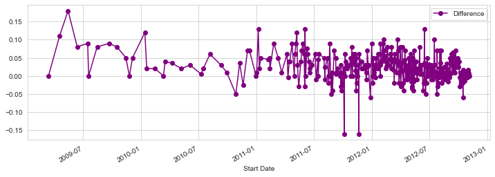
    


We see a few major jumps in difference between the two candidates.  Itd be interesting to see how the debates played a role into these jumps

The debates that year occured on Oct 3rd, 11th, and 22nd. Lets plot some lines as markers for these dates


```python
import datetime as dt

#Create time series visualization for month of october '12
fig=poll_df.plot('Start Date','Difference',figsize=(12,4),marker='o',color='purple',xlim=(dt.datetime(2012, 10, 1),dt.datetime(2012, 10, 31)))

#Oct 3rd line marker
plt.axvline(x=dt.datetime(2012, 10, 3) ,linewidth=4,color='grey')
#Oct 11th line marker
plt.axvline(x=dt.datetime(2012, 10, 11),linewidth=4,color='grey')
#Oct 22nd line marker
plt.axvline(x=dt.datetime(2012, 10, 22),linewidth=4,color='grey')
```


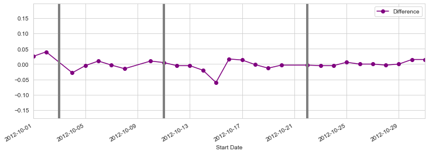
    


We see a more a dip for Obama towards Romney after the first two debates.  It would be intersting to see where these polls were conducted to see if their historically Republican or Democrat.

Now lets look at some donations to candidates campaigns.

## Donor Data Set

The questions we will be trying to answer while looking at this Data Set is:

1) How much was donated and what was the average donation?

2) How did the donations differ between candidates?

3) How did the donations differ between Democrats and Republicans?

4) What were the demographics of the donors?

5) Is there a pattern to donation amounts?


```python
#Import dataset into a DataFrame
donor_df = pd.read_csv('/Users/alexreynolds/Documents/Data Projects/Election Analysis/Election_Donor_Data.csv')
```

```python
#Overview of the dat
donor_df.info()
```

    <class 'pandas.core.frame.DataFrame'>
    RangeIndex: 1001731 entries, 0 to 1001730
    Data columns (total 16 columns):
     #   Column             Non-Null Count    Dtype  
    ---  ------             --------------    -----  
     0   cmte_id            1001731 non-null  object 
     1   cand_id            1001731 non-null  object 
     2   cand_nm            1001731 non-null  object 
     3   contbr_nm          1001731 non-null  object 
     4   contbr_city        1001712 non-null  object 
     5   contbr_st          1001727 non-null  object 
     6   contbr_zip         1001620 non-null  object 
     7   contbr_employer    988002 non-null   object 
     8   contbr_occupation  993301 non-null   object 
     9   contb_receipt_amt  1001731 non-null  float64
     10  contb_receipt_dt   1001731 non-null  object 
     11  receipt_desc       14166 non-null    object 
     12  memo_cd            92482 non-null    object 
     13  memo_text          97770 non-null    object 
     14  form_tp            1001731 non-null  object 
     15  file_num           1001731 non-null  int64  
    dtypes: float64(1), int64(1), object(14)
    memory usage: 122.3+ MB


We have a fairly large dataset with over a million rows of data.


```python
#Preview  what the first few rows of data look like
donor_df.head()
```

<table border="1" class="dataframe">
  <thead>
    <tr style="text-align: right;">
      <th></th>
      <th>cmte_id</th>
      <th>cand_id</th>
      <th>cand_nm</th>
      <th>contbr_nm</th>
      <th>contbr_city</th>
      <th>contbr_st</th>
      <th>contbr_zip</th>
      <th>contbr_employer</th>
      <th>contbr_occupation</th>
      <th>contb_receipt_amt</th>
      <th>contb_receipt_dt</th>
      <th>receipt_desc</th>
      <th>memo_cd</th>
      <th>memo_text</th>
      <th>form_tp</th>
      <th>file_num</th>
    </tr>
  </thead>
  <tbody>
    <tr>
      <th>0</th>
      <td>C00410118</td>
      <td>P20002978</td>
      <td>Bachmann, Michelle</td>
      <td>HARVEY, WILLIAM</td>
      <td>MOBILE</td>
      <td>AL</td>
      <td>3.6601e+08</td>
      <td>RETIRED</td>
      <td>RETIRED</td>
      <td>250.0</td>
      <td>20-JUN-11</td>
      <td>NaN</td>
      <td>NaN</td>
      <td>NaN</td>
      <td>SA17A</td>
      <td>736166</td>
    </tr>
    <tr>
      <th>1</th>
      <td>C00410118</td>
      <td>P20002978</td>
      <td>Bachmann, Michelle</td>
      <td>HARVEY, WILLIAM</td>
      <td>MOBILE</td>
      <td>AL</td>
      <td>3.6601e+08</td>
      <td>RETIRED</td>
      <td>RETIRED</td>
      <td>50.0</td>
      <td>23-JUN-11</td>
      <td>NaN</td>
      <td>NaN</td>
      <td>NaN</td>
      <td>SA17A</td>
      <td>736166</td>
    </tr>
    <tr>
      <th>2</th>
      <td>C00410118</td>
      <td>P20002978</td>
      <td>Bachmann, Michelle</td>
      <td>SMITH, LANIER</td>
      <td>LANETT</td>
      <td>AL</td>
      <td>3.68633e+08</td>
      <td>INFORMATION REQUESTED</td>
      <td>INFORMATION REQUESTED</td>
      <td>250.0</td>
      <td>05-JUL-11</td>
      <td>NaN</td>
      <td>NaN</td>
      <td>NaN</td>
      <td>SA17A</td>
      <td>749073</td>
    </tr>
    <tr>
      <th>3</th>
      <td>C00410118</td>
      <td>P20002978</td>
      <td>Bachmann, Michelle</td>
      <td>BLEVINS, DARONDA</td>
      <td>PIGGOTT</td>
      <td>AR</td>
      <td>7.24548e+08</td>
      <td>NONE</td>
      <td>RETIRED</td>
      <td>250.0</td>
      <td>01-AUG-11</td>
      <td>NaN</td>
      <td>NaN</td>
      <td>NaN</td>
      <td>SA17A</td>
      <td>749073</td>
    </tr>
    <tr>
      <th>4</th>
      <td>C00410118</td>
      <td>P20002978</td>
      <td>Bachmann, Michelle</td>
      <td>WARDENBURG, HAROLD</td>
      <td>HOT SPRINGS NATION</td>
      <td>AR</td>
      <td>7.19016e+08</td>
      <td>NONE</td>
      <td>RETIRED</td>
      <td>300.0</td>
      <td>20-JUN-11</td>
      <td>NaN</td>
      <td>NaN</td>
      <td>NaN</td>
      <td>SA17A</td>
      <td>736166</td>
    </tr>
  </tbody>
</table>
Probably would be helpful to see what the donation amounts look like.


```python
#Get donation amounts and count of how many times that was donated
donor_df['contb_receipt_amt'].value_counts()
```


    100.00    178188
    50.00     137584
    25.00     110345
    250.00     91182
    500.00     57984
               ...  
    97.15          1
    122.32         1
    188.65         1
    122.40         1
    132.12         1
    Name: contb_receipt_amt, Length: 8079, dtype: int64

There were 8079 different amounts donated.  Probably a lot of uneven dollar amounts (97.15, 122.32, 188.65) as we see at the end of the previous list.

Lets see what the average and standard deviation are.


```python
#Get the mean donation
don_mean = donor_df['contb_receipt_amt'].mean()

#Get the std of the donations
don_std = donor_df['contb_receipt_amt'].std()

print('The average donation was %.2f with a std of %.2f' %(don_mean,don_std))
```

    The average donation was 298.24 with a std of 3749.67


We see a large standard deviation compared to the average.  There must be some large donations or something leading to this large standard deviation. Lets see if we can find out what is leading to this huge std.


```python
#Create new Series from the DataFrame. Use copy to avoid view errors
top_donor = donor_df['contb_receipt_amt'].copy()

#Sort and view new series
top_donor.sort_values()
```


    114604     -30800.00
    226986     -25800.00
    101356      -7500.00
    398429      -5500.00
    250737      -5455.00
                 ...    
    319478     526246.17
    344419    1511192.17
    344539    1679114.65
    326651    1944042.43
    325136    2014490.51
    Name: contb_receipt_amt, Length: 1001731, dtype: float64

We have some negative values and some very large donations.  After a google search, the negative values are likely due to the FEC recording refunds as well as donations.  Even if they arent from this, we need to get rid of the negative values to only look at positive donations made.


```python
#Remove negative values 
top_donor = top_donor[top_donor > 0]

#Sort series again
top_donor = top_donor.sort_values()
```

Weve got rid of all the negatives and sorted the series again.  Lets see what the most common donations were again


```python
#View the top 10 most common donations
top_donor.value_counts().head(10)
```


    100.0     178188
    50.0      137584
    25.0      110345
    250.0      91182
    500.0      57984
    2500.0     49005
    35.0       37237
    1000.0     36494
    10.0       33986
    200.0      27813
    Name: contb_receipt_amt, dtype: int64

See the most common dondations were 100, 50, 25 dollars but top 10 most common ranged from 10 dollars to 2500 dollars.

Most of these common donations are more round numbers (10,20,25,50,100,500,1000 etc).  Lets visualize the data to see if this is true


```python
#Create a Series of the common donations less than 2500
com_don = top_donor[top_donor < 2500]

#Plot a histogram with 100 bins to account for non_round donations and to see histogram for spikes
com_don.hist(bins=100)

```


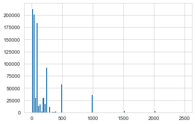
    


Here we can see that the spikes are at the round numbers as we thought.

Next, lets see what the donations look like by party.  Well first need to create a new 'Party' column for each candidate


```python
#Get a list of the unique names for the candidate columns
candidates = donor_df.cand_nm.unique()

#Show all the candidates
candidates
```


    array(['Bachmann, Michelle', 'Romney, Mitt', 'Obama, Barack',
           "Roemer, Charles E. 'Buddy' III", 'Pawlenty, Timothy',
           'Johnson, Gary Earl', 'Paul, Ron', 'Santorum, Rick',
           'Cain, Herman', 'Gingrich, Newt', 'McCotter, Thaddeus G',
           'Huntsman, Jon', 'Perry, Rick'], dtype=object)

Now that we have all the candidates we need to assign a party to them. We know Obama was the only democrat and the rest are republicans so lets use mapping along with a dictonary ot assign party affiliations. 


```python
# Dictionary of party affiliation
party_map = {'Bachmann, Michelle': 'Republican',
           'Cain, Herman': 'Republican',
           'Gingrich, Newt': 'Republican',
           'Huntsman, Jon': 'Republican',
           'Johnson, Gary Earl': 'Republican',
           'McCotter, Thaddeus G': 'Republican',
           'Obama, Barack': 'Democrat',
           'Paul, Ron': 'Republican',
           'Pawlenty, Timothy': 'Republican',
           'Perry, Rick': 'Republican',
           "Roemer, Charles E. 'Buddy' III": 'Republican',
           'Romney, Mitt': 'Republican',
           'Santorum, Rick': 'Republican'}

#Use mapping to assign party affiliation
donor_df['Party'] = donor_df.cand_nm.map(party_map)
```

Next lets make sure we clear any negative/refund amounts from the contributions.


```python
#Clear refunds
donor_df = donor_df[donor_df.contb_receipt_amt >0]

#Preview DF
donor_df.head()
```

<table border="1" class="dataframe">
  <thead>
    <tr style="text-align: right;">
      <th></th>
      <th>cmte_id</th>
      <th>cand_id</th>
      <th>cand_nm</th>
      <th>contbr_nm</th>
      <th>contbr_city</th>
      <th>contbr_st</th>
      <th>contbr_zip</th>
      <th>contbr_employer</th>
      <th>contbr_occupation</th>
      <th>contb_receipt_amt</th>
      <th>contb_receipt_dt</th>
      <th>receipt_desc</th>
      <th>memo_cd</th>
      <th>memo_text</th>
      <th>form_tp</th>
      <th>file_num</th>
      <th>Party</th>
    </tr>
  </thead>
  <tbody>
    <tr>
      <th>0</th>
      <td>C00410118</td>
      <td>P20002978</td>
      <td>Bachmann, Michelle</td>
      <td>HARVEY, WILLIAM</td>
      <td>MOBILE</td>
      <td>AL</td>
      <td>3.6601e+08</td>
      <td>RETIRED</td>
      <td>RETIRED</td>
      <td>250.0</td>
      <td>20-JUN-11</td>
      <td>NaN</td>
      <td>NaN</td>
      <td>NaN</td>
      <td>SA17A</td>
      <td>736166</td>
      <td>Republican</td>
    </tr>
    <tr>
      <th>1</th>
      <td>C00410118</td>
      <td>P20002978</td>
      <td>Bachmann, Michelle</td>
      <td>HARVEY, WILLIAM</td>
      <td>MOBILE</td>
      <td>AL</td>
      <td>3.6601e+08</td>
      <td>RETIRED</td>
      <td>RETIRED</td>
      <td>50.0</td>
      <td>23-JUN-11</td>
      <td>NaN</td>
      <td>NaN</td>
      <td>NaN</td>
      <td>SA17A</td>
      <td>736166</td>
      <td>Republican</td>
    </tr>
    <tr>
      <th>2</th>
      <td>C00410118</td>
      <td>P20002978</td>
      <td>Bachmann, Michelle</td>
      <td>SMITH, LANIER</td>
      <td>LANETT</td>
      <td>AL</td>
      <td>3.68633e+08</td>
      <td>INFORMATION REQUESTED</td>
      <td>INFORMATION REQUESTED</td>
      <td>250.0</td>
      <td>05-JUL-11</td>
      <td>NaN</td>
      <td>NaN</td>
      <td>NaN</td>
      <td>SA17A</td>
      <td>749073</td>
      <td>Republican</td>
    </tr>
    <tr>
      <th>3</th>
      <td>C00410118</td>
      <td>P20002978</td>
      <td>Bachmann, Michelle</td>
      <td>BLEVINS, DARONDA</td>
      <td>PIGGOTT</td>
      <td>AR</td>
      <td>7.24548e+08</td>
      <td>NONE</td>
      <td>RETIRED</td>
      <td>250.0</td>
      <td>01-AUG-11</td>
      <td>NaN</td>
      <td>NaN</td>
      <td>NaN</td>
      <td>SA17A</td>
      <td>749073</td>
      <td>Republican</td>
    </tr>
    <tr>
      <th>4</th>
      <td>C00410118</td>
      <td>P20002978</td>
      <td>Bachmann, Michelle</td>
      <td>WARDENBURG, HAROLD</td>
      <td>HOT SPRINGS NATION</td>
      <td>AR</td>
      <td>7.19016e+08</td>
      <td>NONE</td>
      <td>RETIRED</td>
      <td>300.0</td>
      <td>20-JUN-11</td>
      <td>NaN</td>
      <td>NaN</td>
      <td>NaN</td>
      <td>SA17A</td>
      <td>736166</td>
      <td>Republican</td>
    </tr>
  </tbody>
</table>


Next we need to aggregate data by candidate and view their total amounts received and total number of donations


```python
#Groupby candidate then see total number of people who donated
donor_df.groupby('cand_nm')['contb_receipt_amt'].count()
```


    cand_nm
    Bachmann, Michelle                 13082
    Cain, Herman                       20052
    Gingrich, Newt                     46883
    Huntsman, Jon                       4066
    Johnson, Gary Earl                  1234
    McCotter, Thaddeus G                  73
    Obama, Barack                     589127
    Paul, Ron                         143161
    Pawlenty, Timothy                   3844
    Perry, Rick                        12709
    Roemer, Charles E. 'Buddy' III      5844
    Romney, Mitt                      105155
    Santorum, Rick                     46245
    Name: contb_receipt_amt, dtype: int64

See a huge difference for Obama vs any other candidate as he is not competing against any other democratic nominee, this makes sense.  

Lets see the total amount of money received


```python
#Groupby candidate and then display total amount of money donated
donor_df.groupby('cand_nm')['contb_receipt_amt'].sum()
```


    cand_nm
    Bachmann, Michelle                2.711439e+06
    Cain, Herman                      7.101082e+06
    Gingrich, Newt                    1.283277e+07
    Huntsman, Jon                     3.330373e+06
    Johnson, Gary Earl                5.669616e+05
    McCotter, Thaddeus G              3.903000e+04
    Obama, Barack                     1.358774e+08
    Paul, Ron                         2.100962e+07
    Pawlenty, Timothy                 6.004819e+06
    Perry, Rick                       2.030575e+07
    Roemer, Charles E. 'Buddy' III    3.730099e+05
    Romney, Mitt                      8.833591e+07
    Santorum, Rick                    1.104316e+07
    Name: contb_receipt_amt, dtype: float64

This is very hard to read so lets find an easier way to see this data.

Maybe if we use a for loop to print the values out itll be easier to read.


```python
#Create an object using the groupby
cand_amount = donor_df.groupby('cand_nm')['contb_receipt_amt'].sum()

#index tracker
i=0


for don in cand_amount:
    print('The candidate %s raised %.0f dollars' %(cand_amount.index[i],don))
    print('\n')
    i+=1
```

    The candidate Bachmann, Michelle raised 2711439 dollars
    
    The candidate Cain, Herman raised 7101082 dollars
    
    The candidate Gingrich, Newt raised 12832770 dollars
    
    The candidate Huntsman, Jon raised 3330373 dollars
    
    The candidate Johnson, Gary Earl raised 566962 dollars
    
    The candidate McCotter, Thaddeus G raised 39030 dollars
    
    The candidate Obama, Barack raised 135877427 dollars
    
    The candidate Paul, Ron raised 21009620 dollars
    
    The candidate Pawlenty, Timothy raised 6004819 dollars
    
    The candidate Perry, Rick raised 20305754 dollars
    
    The candidate Roemer, Charles E. 'Buddy' III raised 373010 dollars
    
    The candidate Romney, Mitt raised 88335908 dollars
    
    The candidate Santorum, Rick raised 11043159 dollars


This is a little better but still hard to see.  Lets visualize it


```python
#Plot total donation amounts
cand_amount.plot(kind='bar')
```


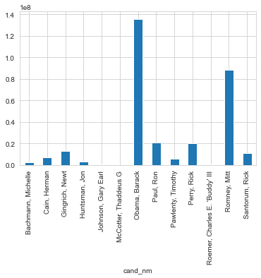
    


Much better and easier to compare.  As we saw with the total people who donated, Obama is the clear advantage in donation amounts too. Again likely because hes not competing against any other democratic nominees.  Lets see  what this looks like comparing republican vs democrate.


```python
#Groupby party then count donation amounts
donor_df.groupby('Party')['contb_receipt_amt'].sum().plot(kind='bar')
```


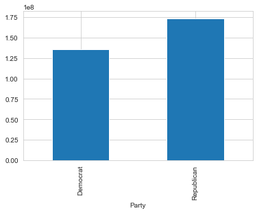
    


Here we see that the republicans had more total donated but this amount was across many candidates

Finally, let see what occupations these donations came from.


```python
#Use a pivot table to  extract and organize data by donor occupation
occupation_df = donor_df.pivot_table('contb_receipt_amt',index = 'contbr_occupation',columns = 'Party',aggfunc='sum')
```


```python
#Preview this DF
occupation_df.head()
```

<table border="1" class="dataframe">
  <thead>
    <tr style="text-align: right;">
      <th>Party</th>
      <th>Democrat</th>
      <th>Republican</th>
    </tr>
    <tr>
      <th>contbr_occupation</th>
      <th></th>
      <th></th>
    </tr>
  </thead>
  <tbody>
    <tr>
      <th>MIXED-MEDIA ARTIST / STORYTELLER</th>
      <td>100.0</td>
      <td>NaN</td>
    </tr>
    <tr>
      <th>AREA VICE PRESIDENT</th>
      <td>250.0</td>
      <td>NaN</td>
    </tr>
    <tr>
      <th>RESEARCH ASSOCIATE</th>
      <td>100.0</td>
      <td>NaN</td>
    </tr>
    <tr>
      <th>TEACHER</th>
      <td>500.0</td>
      <td>NaN</td>
    </tr>
    <tr>
      <th>THERAPIST</th>
      <td>3900.0</td>
      <td>NaN</td>
    </tr>
  </tbody>
</table>


```python
#Check size of DF
occupation_df.shape
```


    (45067, 2)

Over 45000 different occupations donated which is probably too large to have an effective analysis. Lets have cut-off total contribution amount.  Small 50 dollar donations by one type of profession wont give much insigh anyways.  

Lets set the cut off at 1 million dollars to see what this gives us


```python
#Set cut off at 1000000
occupation_df = occupation_df[occupation_df.sum(1) > 1000000]
```


```python
#Recheck size
occupation_df.shape
```


    (31, 2)

Much more managable.  Lets see what a visualization looks like


```python
# plot out with pandas
occupation_df.plot(kind='bar')
```


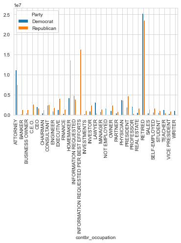
    


This is ok but kind of hard to read.  Lets see what a horizontal bar graph looks like 


```python
#Horizontal bar plot
occupation_df.plot(kind='barh',figsize=(10,12),cmap ='seismic'
```


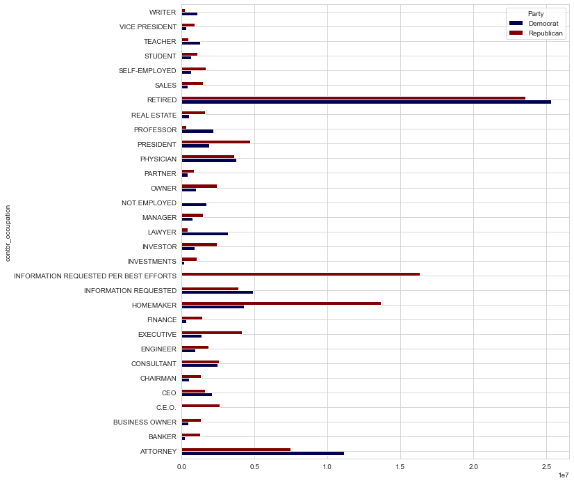
    


We see some occupations that a mislabled or arent occupations.  So lets get rid of them and combine CEO and C.E.O.


```python
#Drop irrelevant occupations
occupation_df.drop(['INFORMATION REQUESTED PER BEST EFFORTS','INFORMATION REQUESTED'],axis=0,inplace=True)
```


```python
#Combine CEO and C.E.O.
occupation_df.loc['CEO'] = occupation_df.loc['CEO'] + occupation_df.loc['C.E.O.']

occupation_df.drop('C.E.O.', inplace = True)
```


```python
#Repeat Previous plot
occupation_df.plot(kind='barh',figsize=(10,12),cmap='seismic')
```


​    
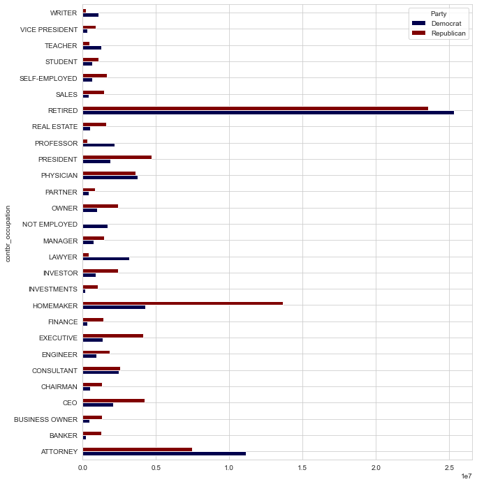


Much easier to read and compare. We see CEO/President/Homemaker are more conservate leaning while Professor/Attorney/Lawyers are more liberal.
